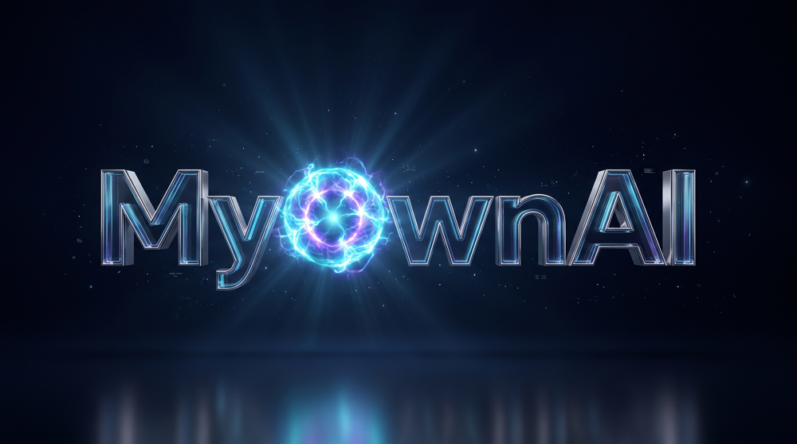

<div align="center">

<a href="https://myownailabs.com"></a>

# AI Content Engine

### Your sources. Your voice. A sourced newsletter and a narrated video, from one brief.

[](LICENSE)
[](https://nodejs.org)
[](#quick-start)
[](#free-and-pro)

[Quick start](#quick-start) · [How an edition is built](#how-an-edition-is-built) · [Writers](#writers) · [Free and Pro](#free-and-pro) · [After you publish](#after-you-publish) · [License](#license-and-trademarks)

</div>

---

Describe your audience and what they should learn. The engine finds current, readable sources on the topic, picks the stories, writes a fact-checked script, formats it into a newsletter, attaches each story's own photograph or a diagram, narrates it, renders a short video, and stops at a private preview for you to review. Publishing is a separate, deliberate step. Every claim in the script is pinned to the source it came from before a word is written, and the script is judged against those claims before anything is narrated or rendered.

## See it

<div align="center">

<video src="https://github.com/user-attachments/assets/e2adb25c-ceec-498e-b344-d7961cd9da24" poster="docs/journey-assets/walkthrough-poster.jpg" controls muted playsinline width="720"></video>

*Jordan's Journey — the whole product in eight minutes. [Full-quality file](docs/journey-assets/walkthrough-v8.mp4) · [captions](docs/journey-assets/walkthrough-v8.vtt)*
</div>

Sixteen stages, in order: four stages in one workspace · describe the result you want · make it yours · add presenters when you want them · create your private preview · choose the visual for each story · see your finished preview · see the finished video variants · choose your destinations · review and publish deliberately · track delivery and audience results · follow up with your audience · see usage and cost limits · every local model with its editorial status · improve the next edition · book your demo.

## Quick start

Install [Node.js 22.13 or newer](https://nodejs.org) with npm. Then, in a new directory:

```sh
node start.mjs
```

That installs the declared dependencies and opens your workspace in the browser on your own computer (loopback only; nothing is exposed to the network). Then:

1. **Describe** your publication in a sentence or two. Sources are found automatically; trusted websites are optional.
2. **Choose a writer** you already have an account with (Claude, Codex, Antigravity or Grok) and check its connection.
3. **Create my preview.** In a few minutes you have a newsletter and a narrated video to review, side by side.

Nothing is posted until you choose to publish. Reload the page and it reopens the same result.

## How an edition is built

```
brief ─► sources ─► stories ─► script ─► newsletter ─► visuals ─► narration ─► video ─► preview ─► publish
          find      select    write +    format the    photo /    narrate     render   review     your call
          readable  & pin     fact-check pinned        diagram /  with ASR              both
          pages     claims    the script script        card       check
```

- **Sources** are found for your topics and read; only pages that are actually readable count. If fewer than expected are found, the edition is shorter, never stopped.
- **Stories** are selected and every factual claim is pinned to its source before writing starts. Those pinned claims are the whole fact budget.
- **The script** is written once, then judged against the pinned claims. Blocking findings drive one automatic repair. A finding that quotes wording the script does not contain cannot block it.
- **The newsletter** is the accepted script, formatted. Nothing is researched or reviewed again at this stage; length and shape are checked before any narration is bought.
- **Visuals** per story: the source's own photograph (with attribution and a rights note), an authored diagram checked at phone size, or an attributed headline card. You choose, or accept the recommendation.
- **Narration and video** use the built-in narrator or your own local voice, with a transcript check on the audio, then render locally.
- **Preview** shows the newsletter and video together. Publishing to a connected channel is a separate, explicit action.

## Writers

Bring the account you already have. The Free edition offers the four writers that have each produced a finished edition from a plain brief on a fresh workspace.

| Writer | How it connects | Can it review images? | In Free |
|---|---|---|---|
| **Claude** (default) | Claude Code CLI, your saved login | Yes | Yes |
| **Codex** | Codex CLI, your saved login | Yes | Yes |
| **Grok** | Grok CLI, your account | Yes | Yes |
| **Antigravity** | Google Antigravity `agy` CLI (Gemini), your sign-in | No, text only | Yes |
| Local models (Ollama), OpenCode, Gemini API, Z.AI, Bedrock, other compatible APIs | your own service or key | varies | Listed, offered in Pro |

A text-only writer still gets the story's own source photograph attached, with attribution and an explicit "unreviewed" note, and the rights note holds publishing until you clear it. You can also upload your own image for any story; it is fitted to the video frame and the newsletter column. With neither, the story ships as an attributed headline card. A diagram is authored only by a writer that can review images.

Every writer runs through the same checks: pinned claims, one script judge, transcript-checked narration, and a phone-size review of any authored artwork. The checks are the same for a local model and a hosted one; they do not guarantee factual accuracy, and the preview is there for you to read.

## Free and Pro

| | Free (this package) | Pro (planned, $99/month) |
|---|---|---|
| Sources, story selection, fact-checked script, newsletter, visuals, narration, video, preview | Yes | Yes |
| Writers | Claude, Codex, Antigravity, Grok | plus local models, OpenCode and API routes |
| Design | neutral newsletter and video design | your brand, style and presenters |
| Narration | built-in narrator, or a local voice you configure | plus hosted voices and presenters |
| Publishing to your connected channels | Yes, after your review | Yes, with automated approval after your first approved editions |
| Audience engagement (reactions, comments, drafted replies) | — | Yes |
| Audience analytics and link attribution | — | Yes |
| LinkedIn writing tools (posts, repurposing, audits, replies) | Yes, nine tasks | Yes |

No checkout, billing or premium pack ships in this package. Browsing the Pro options in the Journey never activates them. See [the exact boundary](docs/free-vs-pro.md).

## After you publish

Publishing is the last stage of the Journey. The engine records delivery status for each channel. Collecting reactions and comments on the published post, drafting replies for your approval, and audience analytics are built into the engine and are offered in Pro; in Free you publish and review your own delivery receipts. See [audience engagement](docs/engagement.md) for how the follow-up loop works when it is enabled.

## Verify

```sh
npm test          # the Free package's own checks: fresh workspace, private server, Free defaults, Pro refusals, no outward calls
npm run test:unit
npm run typecheck
npm run dry-run   # synthetic: exercises the pipeline with no model, voice or network
```

Fixture tests prove the plumbing, not the quality of a real edition; read the preview.

## Your data

Everything stays under `workspaces/<workspace>/`: the brief, a private `.env`, receipts under `state/`, outputs under `workdir/`. Delete that folder to remove a publication and its history. Source fetching uses public HTTPS only and rejects redirects, private addresses and oversized responses. The local server is for your own computer and is not built for exposure to the internet.

## License and trademarks

The original harness source is [MIT](LICENSE): use it, modify it, redistribute it. The MyOwnAI name and logo are trademarks of MyOwnAI Labs and are not covered by the MIT license; a fork must use its own name and mark. See [NOTICE](NOTICE). Dependencies keep their own licenses, including Remotion and the bundled fonts; see [third-party notices](THIRD_PARTY_NOTICES.md).

To report a reproducible issue or propose a scoped patch, read [Testing and contributing](CONTRIBUTING.md).

---

<details>
<summary><b>Details for operators</b> — local writers, bounded preparation, research limits, memory</summary>

### The harness is review-mode by default

In **Human in the loop** mode every edition ends at a private preview, and publishing is a step you take yourself. The Journey's **Automated** mode approves and publishes previews whose checks pass, and only after the first editions you have approved by hand; a failed check or an uncleared photograph still stops for you.

### Local writers and optional cloud help

Ollama runs an installed model on your computer. The OpenCode route supports an exact installed Ollama model or a native OpenCode free-model route; the latter runs in the cloud and is subject to provider limits. The isolated writing adapter has no tools or inherited project instructions. New workspaces keep Claude/Codex fallback off; if you enable it, the default limit is two hosted calls per workspace per day (America/New_York), including retries. A local editorial check and a source-to-story review do not certify every local model or finished media quality. Claude editorial writing disables tools and inherited customizations; a Claude CLI without the required safe-mode flags fails closed.

### Bounded newsletter preparation

Full editions prepare enough supported material for every selected topic before writing. The writer handles one topic at a time; code assigns and checks word ranges, source IDs and final ordering. A selected length is sized for a three-story issue and its floor is lowered for a shorter one. Newsletter text completes before media production. Exact package, model and settings identities preserve checkpoints and cumulative call limits; changing the request cannot refill its original allowance.

### Topic research and current limits

The selected writer can plan topic searches; the harness performs bounded HTTPS searches and reads, preserves the original topic and primary source, and retains complete extracted source text with hashes. Article qualifications stay with the source; partial responses and clipped text cannot become evidence. Each new full package shares one allowance of 96 model attempts, 24 tool uses and 1800 seconds across research, preparation and writing unless explicit role settings choose different supported limits. Retries and JSON corrections count. Every selected topic must pass the requested length and source checks before a newsletter is accepted. Current small-model factual review is not qualified.

### Preferences and memory

Basic personal preferences and correction reminders are optional in Free and Pro (**Personalize → About you & remembered corrections**). Background and raw notes never determine news topics or enter source evidence. Publication memory keeps fresh edition state, scoped preferences and reviewed process lessons; source-backed event identity prevents a shared buzzword, company or URL from becoming a duplicate verdict. See [memory and correction controls](docs/publication-memory.md) and [personal preferences](docs/personal-preferences.md). Drafts receive separate checks of what their words assert and what their sources establish; models select citation spans by ID and code preserves and verifies the exact text.

### More

[Choose a model](docs/model-providers.md) · [Connect your agent](docs/agent-compatibility.md) · [Connectors and voice](docs/connect-and-voice.md) · [Story visualization](docs/story-visualization.md) · [Channel connections](docs/channel-authorization.md) · [Control API](docs/control-api.md)

</details>
