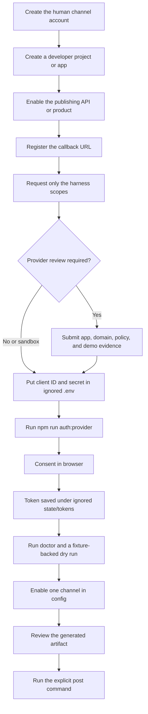

# Channel Accounts and Authorization

The browser **Channels** step saves these credentials and starts the existing authorization flows. **Newsletter URL and cover** saves the series URL and a private PNG/JPEG cover for new issues. In **Engagement**, the separate YouTube comment-consent button requests `youtube.force-ssl`; ordinary Google auth retains its existing upload scopes. X/YouTube API reply support and manual fallbacks are documented in [viewer engagement](engagement.md). OAuth callbacks validate a fresh state value on the loopback listener before accepting a code.

Start with the [browser walkthrough](personalize-and-publish.html#channels), including voice/video, release order, analytics and team usage. Paths such as `.env`, `config/` and `state/tokens/` below are relative to the **selected workspace**, normally `workspaces/default/`; commands run at the repository root.

This guide separates four different gates that are often confused: owning a channel account, registering a developer app, receiving the provider's publishing permission, and authorizing the harness to act for one account. Completing only the first gate does not permit API publishing.

Provider requirements, audits, pricing, and review timelines can change. Verify the linked official documentation before submitting an app for review.

## Authorization flow

## Shared harness rules

- Register `http://localhost:8585/callback` exactly for Google, LinkedIn, Meta, Threads, X, and Reddit. A path, port, protocol, or trailing-slash mismatch can invalidate OAuth.
- TikTok production apps are the exception: configure an approved HTTPS callback and set the same value in `TIKTOK_REDIRECT_URI`. Keep a tunnel running that forwards its `/callback` to the harness listener on localhost port 8585.
- Put client IDs, client secrets, and provider keys only in the ignored `.env` file.
- OAuth tokens are written to ignored `state/tokens/<provider>.json`. Never commit or send that directory to testers.
- Start with private, sandbox, or test visibility. Passing OAuth proves authorization, not that provider review or public posting is approved.
- Run `npm run doctor`, produce from a fixture, inspect the result, and enable one channel at a time.

## Channel matrix

| Channel | Account and developer setup | Harness authorization | Requested permission | Provider gate to expect |
|---|---|---|---|---|
| YouTube | Create a Google account and YouTube channel; create a Google Cloud project; enable YouTube Data API v3; configure OAuth consent and a web OAuth client | Set `GOOGLE_CLIENT_ID`, `GOOGLE_CLIENT_SECRET`; run `npm run auth:google` | `https://www.googleapis.com/auth/youtube.upload` | Test users are needed while the consent app is in testing; public use may require Google verification |
| LinkedIn | Create a LinkedIn developer app; add Sign In with LinkedIn using OpenID Connect and Share on LinkedIn products | Set `LINKEDIN_CLIENT_ID`, `LINKEDIN_CLIENT_SECRET`; run `npm run auth:linkedin` | `openid profile w_member_social` | `w_member_social` comes from the Share on LinkedIn product; organization posting needs separate permissions and is not this member-posting flow |
| Instagram | Create an Instagram professional account and a Meta developer app with the Instagram API with Instagram Login use case | Generate the long-lived token in the app dashboard, save it as ignored `state/tokens/instagram.json` with camelCase `accessToken` and actual ISO `expiresAt`, and set `IG_USER_ID` | `instagram_business_basic`, `instagram_business_content_publish` | App review/business verification may be required outside app-role testing; `npm run auth:meta` is not a substitute for the current direct Instagram-token path |
| Threads | Create a Threads profile and a separate Meta app/use case for Threads | Set `THREADS_APP_ID`, `THREADS_APP_SECRET`; run `npm run auth:threads` | `threads_basic`, `threads_content_publish` | Meta app review may be required for users who do not have an app role |
| TikTok | Create a TikTok account and TikTok for Developers app; add Content Posting API and Direct Post | Set `TIKTOK_CLIENT_KEY`, `TIKTOK_CLIENT_SECRET`, approved `TIKTOK_REDIRECT_URI`; run `npm run auth:tiktok` | `user.info.basic`, `video.publish` | `video.publish` requires approval; unaudited clients are restricted to private visibility |
| X | Create an X account, developer account/project, and OAuth 2.0 app configured as a confidential client with the exact callback | Set `X_CLIENT_ID`, `X_CLIENT_SECRET`; run `npm run auth:x` | `tweet.read tweet.write users.read media.write offline.access` | API access or credits may be required; callback matching is exact and posting requires user-context OAuth |
| Reddit | Obtain Reddit API access approval and configure a `web app` at Reddit app preferences; use the exact callback and a descriptive User-Agent | Set `REDDIT_CLIENT_ID`, `REDDIT_CLIENT_SECRET`, `REDDIT_USER_AGENT`, `REDDIT_SUBREDDIT`; run `npm run auth:reddit` | `submit identity`, permanent duration | The destination subreddit must allow the account to submit; its rules and moderation still apply |

## Channel-by-channel setup

### 1. YouTube

1. Create the destination YouTube channel under the Google account that will own uploads.
2. In [Google Cloud Console](https://console.cloud.google.com/), create a project and enable YouTube Data API v3.
3. Configure the OAuth consent screen. While it is in testing, add each tester explicitly.
4. Create OAuth client credentials that accept `http://localhost:8585/callback`.
5. Add the client ID and secret to `.env`, then run `npm run auth:google` and consent with the destination channel account.
6. Keep `YOUTUBE_PRIVACY_STATUS=private` until an uploaded test video is inspected.

Official references: [YouTube OAuth](https://developers.google.com/youtube/v3/guides/authentication) and [video upload](https://developers.google.com/youtube/v3/guides/uploading_a_video).

### 2. LinkedIn

1. Create an app in the [LinkedIn Developer Portal](https://www.linkedin.com/developers/apps).
2. Add the OpenID Connect and Share on LinkedIn products.
3. Register `http://localhost:8585/callback` as an authorized redirect URL.
4. Add the client ID and secret to `.env`, run `npm run auth:linkedin`, and approve member posting.
5. Reauthorize before the stored token expires; the harness warns when fewer than seven days remain.

Official reference: [Share on LinkedIn](https://learn.microsoft.com/en-us/linkedin/consumer/integrations/self-serve/share-on-linkedin).

### 3. Instagram

1. Use an Instagram professional account and create a Meta app with Instagram API with Instagram Login.
2. Add the destination account as an app-role tester during development and accept the invitation in Instagram.
3. Generate a long-lived access token from the app dashboard's Instagram API setup.
4. Save `state/tokens/instagram.json` as `{ "accessToken": "YOUR_TOKEN", "expiresAt": "ACTUAL_ISO_EXPIRY" }`; set `IG_USER_ID` in `.env`.
5. Prepare a public final MP4 URL before publishing. There is no harness Instagram private-post switch; inspect local drafts and account eligibility before a deliberate live post.

Official reference: [Instagram content publishing](https://developers.facebook.com/docs/instagram-platform/instagram-api-with-instagram-login/content-publishing/).

### 4. Threads

1. Create a Meta developer app with the Threads API use case and configure its OAuth settings.
2. Register `http://localhost:8585/callback`.
3. Add `THREADS_APP_ID` and `THREADS_APP_SECRET` to `.env`.
4. Run `npm run auth:threads`; the harness exchanges the initial token for a long-lived token.
5. Complete Meta review before authorizing accounts that are not app-role users.

Official reference: [Threads publishing](https://developers.facebook.com/docs/threads/posts/).

### 5. TikTok

1. Create a developer account and app at [TikTok for Developers](https://developers.tiktok.com/).
2. Add Content Posting API, enable Direct Post, register/verify required URLs, and request `video.publish` approval.
3. Register an HTTPS callback. Put that exact URL in `TIKTOK_REDIRECT_URI` with the client key and secret.
4. Run `npm run auth:tiktok` and authorize the destination creator account.
5. This harness hard-codes `SELF_ONLY`. TikTok stays private even after app approval; changing `TIKTOK_PRIVACY` cannot enable public posting in this beta.

Official references: [create an app](https://developers.tiktok.com/doc/getting-started-create-an-app) and [Content Posting API](https://developers.tiktok.com/doc/content-posting-api-get-started/).

### 6. X

1. Create a project/app in the [X Developer Console](https://developer.x.com/en/portal/dashboard).
2. Enable OAuth 2.0 Authorization Code with PKCE, select a confidential client, and register `http://localhost:8585/callback` exactly.
3. Enable read/write permissions and the scopes shown in the matrix.
4. Add `X_CLIENT_ID` and `X_CLIENT_SECRET` to `.env`, then run `npm run auth:x`.
5. Confirm the account's API access/credits before treating a successful consent flow as posting readiness.

Official reference: [X OAuth 2.0 Authorization Code with PKCE](https://docs.x.com/fundamentals/authentication/oauth-2-0/authorization-code).

### 7. Reddit

1. Obtain approval under Reddit’s [Responsible Builder Policy](https://support.reddithelp.com/hc/en-us/articles/42728983564564-Responsible-Builder-Policy), then sign in and configure a `web app` at [app preferences](https://www.reddit.com/prefs/apps).
2. Register `http://localhost:8585/callback` and record the client ID and secret.
3. Set a descriptive `REDDIT_USER_AGENT`, for example `web:content-harness:v0.2 (by /u/your_account)`.
4. Set a test destination in `REDDIT_SUBREDDIT`, run `npm run auth:reddit`, and grant permanent `submit identity` access.
5. Verify the destination community's rules and account eligibility before posting.

Official references: [Reddit OAuth](https://github.com/reddit-archive/reddit/wiki/OAuth2) and [OAuth endpoint scopes](https://www.reddit.com/dev/api/oauth).

## Acceptance checklist

- The developer dashboard shows the exact callback URL.
- Only the scopes in the channel matrix are requested.
- `.env` and `state/tokens/` remain ignored and absent from release archives.
- `npm run doctor` recognizes required local configuration.
- A fixture-backed dry run completes without network publishing.
- The first live upload/post uses private, sandbox, or test visibility where the provider supports it.
- The returned post/upload identifier is checked in the actual destination account.

## Release and measurement are separate

Enable selected entries in the workspace `config/platforms.json`. Instagram/Threads need a previously resolved LinkedIn video receipt or a real hosted HTTPS file matching `PUBLIC_VIDEO_URL_TEMPLATE`; setting the template uploads nothing. Generate the newsletter before approving the package, establish the separate LinkedIn newsletter browser login, publish and verify the exact day/edition issue, then post with `--id`. All video destinations require that live issue. [Complete release steps](personalize-and-publish.html#release).

Posting OAuth is not analytics authorization. Current Google/Threads/TikTok helpers do not add missing read/insights scopes on repeat login. [Metrics and dashboard setup](personalize-and-publish.html#metrics) explains collector limits and refresh commands. Doctor and fixture dry-run do not prove provider eligibility.
